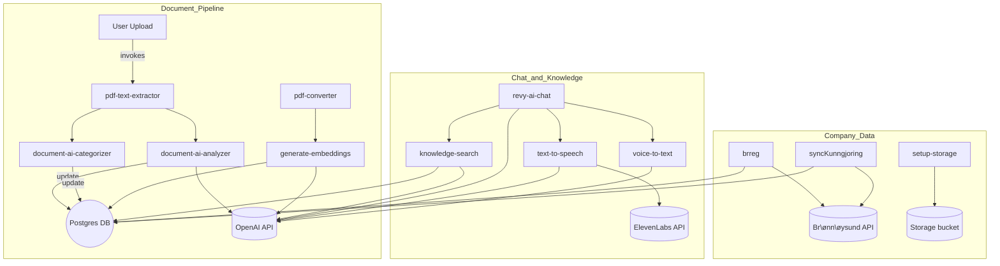

# Backend Endpoint Data Flow

This diagram shows how the main Supabase Edge Functions interact with each other, the database and external services.

```mermaid
graph TD
  subgraph Document_Pipeline
    Upload["User Upload"] --> |"invokes"| PDFExtractor[pdf-text-extractor]
    PDFExtractor --> DocumentAnalyzer[document-ai-analyzer]
    PDFExtractor --> DocumentCategorizer[document-ai-categorizer]
    DocumentAnalyzer -->|"update"| DB((Postgres DB))
    DocumentCategorizer -->|"update"| DB
    DocumentAnalyzer --> OpenAI[(OpenAI API)]
    PDFConverter[pdf-converter] --> GenerateEmbeddings[generate-embeddings]
    GenerateEmbeddings --> OpenAI
    GenerateEmbeddings --> DB
  end

  subgraph Chat_and_Knowledge
    Chat[revy-ai-chat] --> KnowledgeSearch[knowledge-search]
    KnowledgeSearch --> DB
    KnowledgeSearch --> OpenAI
    Chat --> OpenAI
    Chat --> TextToSpeech[text-to-speech]
    Chat --> VoiceToText[voice-to-text]
    TextToSpeech --> ElevenLabs[(ElevenLabs API)]
    TextToSpeech --> OpenAI
    VoiceToText --> OpenAI
  end

  subgraph Company_Data
    Brreg[brreg] --> BrregAPI[(Br\ønn\øysund API)]
    Brreg --> DB
    Sync[syncKunngjoring] --> BrregAPI
    Sync --> DB
    SetupStorage[setup-storage] --> Storage[(Storage bucket)]
  end
```
