# Database Architecture

## Overview

Revio bruker Supabase (PostgreSQL) som database med Row Level Security (RLS) for tilgangskontroll. Databasen er strukturert rundt følgende hovedområder:

1. **Audit Firm Management** - Revisjonsfirmaer og ansatte
2. **Client Management** - Klienter, teams og relasjoner
3. **Accounting Data** - Regnskap, transaksjoner, balanserapporter
4. **Documents** - Dokumenthåndtering og AI-analyse
5. **Audit Actions** - Revisjonshandlinger og prosesser
6. **Communication** - Chat, meldinger og sanntidssamarbeid
7. **AI & Analysis** - AI-cache, analyse-resultater, embeddings

## Entity Relationship Diagram (ERD)

```mermaid
erDiagram
    %% ========================================
    %% AUDIT FIRM & USER MANAGEMENT
    %% ========================================
    audit_firms ||--o{ departments : "has"
    audit_firms ||--o{ firm_employees : "employs"
    audit_firms ||--o{ profiles : "has_members"
    audit_firms ||--o{ firm_access_requests : "receives"
    
    profiles ||--o{ firm_employees : "links_to"
    profiles ||--o{ firm_access_requests : "creates"
    profiles }o--|| audit_firms : "belongs_to"
    
    %% ========================================
    %% CLIENT MANAGEMENT
    %% ========================================
    audit_firms ||--o{ clients : "manages"
    departments ||--o{ clients : "handles"
    
    clients ||--o{ client_teams : "has"
    clients ||--o{ client_annual_data : "has_yearly_data"
    clients ||--o{ client_roles : "defines_roles"
    clients ||--o{ client_documents_files : "owns_documents"
    clients ||--o{ announcements : "receives"
    
    client_teams ||--o{ team_members : "has_members"
    profiles ||--o{ team_members : "is_member"
    
    %% ========================================
    %% ACCOUNTING DATA
    %% ========================================
    clients ||--o{ accounting_data_versions : "has_versions"
    clients ||--o{ client_chart_of_accounts : "has_accounts"
    clients ||--o{ trial_balances : "has_balances"
    clients ||--o{ general_ledger_transactions : "has_transactions"
    
    accounting_data_versions ||--o{ general_ledger_transactions : "contains"
    accounting_data_versions ||--o{ ar_customer_balances : "summarizes_AR"
    accounting_data_versions ||--o{ ap_supplier_balances : "summarizes_AP"
    
    client_chart_of_accounts ||--o{ general_ledger_transactions : "categorizes"
    client_chart_of_accounts ||--o{ trial_balances : "tracks_balance"
    
    %% ========================================
    %% SAFT IMPORT
    %% ========================================
    clients ||--o{ saft_import_sessions : "imports_data"
    saft_import_sessions ||--o{ saft_customers : "includes"
    saft_import_sessions ||--o{ saft_suppliers : "includes"
    
    %% ========================================
    %% AUDIT ACTIONS & PLANNING
    %% ========================================
    audit_firms ||--o{ audit_action_templates : "defines_templates"
    action_groups ||--o{ audit_action_templates : "groups"
    
    clients ||--o{ client_audit_actions : "has_actions"
    audit_action_templates ||--o{ client_audit_actions : "instantiates"
    
    client_audit_actions ||--o{ document_versions : "has_versions"
    
    clients ||--o{ planning_modules : "has_planning"
    planning_modules ||--o{ planning_sections : "contains"
    planning_sections ||--o{ planning_items : "includes"
    
    %% ========================================
    %% DOCUMENTS & AI
    %% ========================================
    clients ||--o{ client_documents_files : "uploads"
    client_documents_files ||--o{ document_ai_metadata : "analyzed_by_AI"
    client_documents_files ||--o{ ai_suggested_postings : "generates_postings"
    
    document_categories ||--o{ client_documents_files : "categorizes"
    document_types ||--o{ client_documents_files : "classifies"
    
    %% ========================================
    %% COMMUNICATION
    %% ========================================
    clients ||--o{ chat_rooms : "has_rooms"
    chat_rooms ||--o{ messages : "contains"
    profiles ||--o{ messages : "sends"
    profiles ||--o{ user_presence : "tracks_status"
    
    %% ========================================
    %% AI & ANALYSIS
    %% ========================================
    clients ||--o{ ai_analysis_sessions : "runs_analysis"
    clients ||--o{ ai_usage_logs : "logs_AI_usage"
    clients ||--o{ analysis_cache : "caches_results"
    clients ||--o{ ai_conversations : "has_conversations"
    
    ai_conversations ||--o{ ai_messages : "contains"
    
    %% ========================================
    %% ACCOUNT MAPPINGS
    %% ========================================
    standard_chart_of_accounts ||--o{ account_mappings : "maps_to"
    client_chart_of_accounts ||--o{ account_mappings : "maps_from"
    clients ||--o{ account_mappings : "configures"
    
    standard_chart_of_accounts ||--o{ account_mapping_rules : "defines_rules"
    account_mapping_rules ||--o{ account_mapping_suggestions : "generates"
```



## Core Database Concepts

### 1. Multi-Tenancy via Audit Firms

Revio er en **multi-tenant** applikasjon hvor hver `audit_firm` er en isolert tenant:

- Alle data er koblet til `audit_firm_id` (direkte eller via `clients`)
- RLS policies sikrer at brukere bare ser data fra eget firma
- `profiles.audit_firm_id` kobler brukere til firma

### 2. Client Hierarchy

```
audit_firm
  └── department
       └── client
            ├── client_teams (team_members)
            ├── client_annual_data (fiscal years)
            └── accounting_data_versions (datasets)
```

### 3. Accounting Data Versioning

Regnskap lagres i **versjoner** for å støtte:
- Sammenligning mellom perioder
- Parallelle datasett (foreløpig vs. endelig)
- Historikk og sporbarhet

**Nøkkeltabeller:**
- `accounting_data_versions` - Versjon metadata
- `general_ledger_transactions` - Transaksjoner per versjon
- `trial_balances` - Saldobalanse per versjon
- `ar_customer_balances` / `ap_supplier_balances` - Aggregerte saldoer

### 4. Row Level Security (RLS)

**Alle tabeller** har RLS aktivert med policies basert på:

1. **User's Audit Firm** - `auth.uid()` → `profiles.audit_firm_id`
2. **Client Access** - Via `clients.user_id` eller team membership
3. **Role-Based** - Admin/Partner får mer tilgang (via `get_user_role()`)

**Security Definer Functions:**
- `get_user_firm(uuid)` - Hent brukerens firma
- `get_user_role(uuid)` - Hent brukerens rolle
- `is_super_admin(uuid)` - Sjekk super-admin status

**Viktig:** RLS policies bruker security definer functions for å unngå rekursjon.

### 5. AI & Machine Learning

Revio bruker AI for dokumentanalyse og regnskapsautomatisering:

**Embedding-basert søk:**
- `legal_documents.embedding` - Vector embeddings (pgvector)
- `match_legal_documents(vector)` - Semantic search function

**AI Cache:**
- `ai_cache` - Cache for AI-responser (request_hash → response)
- `ai_analysis_cache` - Cache for tunge analyser
- `analysis_cache` - Optimized analysis results

**AI Sessions:**
- `ai_analysis_sessions` - Sporbar AI-analyse med progress
- `ai_conversations` - Multi-agent samtaler
- `ai_messages` - Samtalehistorikk

### 6. Document Management

Dokumenter lagres i **Supabase Storage** med metadata i database:

```
client_documents_files (metadata)
  ├── document_categories (subject_area)
  ├── document_types (classification)
  ├── document_ai_metadata (AI analysis)
  └── ai_suggested_postings (AI-genererte posteringer)
```

**Storage Buckets:**
- `client-documents` - Hovedbucket for alle dokumenter
- RLS policies på `storage.objects` for sikker tilgang

## Migration Strategy

### Applying Migrations

1. **Supabase CLI** (anbefalt for prod):
   ```bash
   supabase db push
   ```

2. **Supabase Dashboard** (for quick fixes):
   - SQL Editor → Kjør migration manuelt

3. **Edge Functions** (automatisk):
   - Migrations kjøres automatisk ved deploy

### Migration Best Practices

✅ **DO:**
- Bruk `IF NOT EXISTS` for tabeller/kolonner
- Inkluder `ALTER TABLE ... ENABLE ROW LEVEL SECURITY`
- Definer RLS policies i samme migration
- Bruk security definer functions for komplekse policies
- Test migrations lokalt først
- Legg til indexes for ytelse

❌ **DON'T:**
- Aldri `DROP TABLE` uten backup
- Unngå `ALTER COLUMN TYPE` på store tabeller (lang locking)
- Ikke hardkod verdier - bruk default values
- Ikke slett RLS policies uten å erstatte dem

### Example Migration Template

```sql
-- ================================================
-- MIGRATION: Add new feature
-- ================================================

-- 1. Create table
CREATE TABLE IF NOT EXISTS public.new_table (
  id uuid PRIMARY KEY DEFAULT gen_random_uuid(),
  client_id uuid NOT NULL REFERENCES public.clients(id) ON DELETE CASCADE,
  created_at timestamptz NOT NULL DEFAULT now(),
  updated_at timestamptz NOT NULL DEFAULT now()
);

-- 2. Enable RLS
ALTER TABLE public.new_table ENABLE ROW LEVEL SECURITY;

-- 3. Create RLS policies
CREATE POLICY "Users can manage their clients' data"
  ON public.new_table
  FOR ALL
  USING (
    client_id IN (
      SELECT id FROM public.clients 
      WHERE user_id = auth.uid()
    )
  );

-- 4. Create indexes
CREATE INDEX idx_new_table_client_id ON public.new_table(client_id);
CREATE INDEX idx_new_table_created_at ON public.new_table(created_at DESC);

-- 5. Add trigger for updated_at
CREATE TRIGGER set_updated_at
  BEFORE UPDATE ON public.new_table
  FOR EACH ROW
  EXECUTE FUNCTION public.set_updated_at();

-- 6. Refresh PostgREST schema cache
SELECT public.refresh_postgrest_schema();
```

## Common Query Patterns

### 1. Get Client Data for Current User

```typescript
const { data, error } = await supabase
  .from('clients')
  .select('*')
  .order('company_name');

// RLS automatically filters to user's accessible clients
```

### 2. Get Latest Accounting Version

```typescript
const { data: version } = await supabase
  .from('accounting_data_versions')
  .select('*')
  .eq('client_id', clientId)
  .eq('is_active', true)
  .single();
```

### 3. Get Transactions with Account Details

```typescript
const { data } = await supabase
  .from('general_ledger_transactions')
  .select(`
    *,
    account:client_chart_of_accounts(account_number, account_name)
  `)
  .eq('version_id', versionId)
  .order('transaction_date', { ascending: false });
```

### 4. Join Across Multiple Tables

```typescript
const { data } = await supabase
  .from('client_audit_actions')
  .select(`
    *,
    template:audit_action_templates(name, subject_area),
    client:clients(name, company_name)
  `)
  .eq('client_id', clientId)
  .eq('status', 'in_progress');
```

## Performance Optimization

### Indexes

**Critical indexes** er definert i migrations:

```sql
-- Lookup by client_id (mest brukt filter)
CREATE INDEX idx_transactions_client_id ON general_ledger_transactions(client_id);

-- Sorting by date
CREATE INDEX idx_transactions_date ON general_ledger_transactions(transaction_date DESC);

-- Composite index for common filters
CREATE INDEX idx_transactions_client_version 
  ON general_ledger_transactions(client_id, version_id);

-- GIN index for JSONB search
CREATE INDEX idx_metadata_gin ON some_table USING GIN(metadata);

-- Vector similarity search
CREATE INDEX idx_embeddings_vector 
  ON legal_documents USING ivfflat(embedding vector_cosine_ops);
```

### Query Optimization Tips

1. **Select only needed columns:**
   ```typescript
   .select('id, name, created_at') // ✅ Good
   .select('*') // ❌ Avoid on large tables
   ```

2. **Use `eq()` for indexed lookups:**
   ```typescript
   .eq('client_id', clientId) // ✅ Uses index
   .filter('client_id', 'eq', clientId) // ✅ Same
   ```

3. **Limit results:**
   ```typescript
   .limit(100) // ✅ Prevent huge result sets
   ```

4. **Use range queries for pagination:**
   ```typescript
   .range(0, 49) // ✅ Efficient pagination
   ```

5. **Avoid N+1 queries - use joins:**
   ```typescript
   // ❌ BAD: N+1 queries
   const clients = await supabase.from('clients').select('*');
   for (const client of clients) {
     const data = await supabase
       .from('client_annual_data')
       .eq('client_id', client.id);
   }
   
   // ✅ GOOD: Single query with join
   const { data } = await supabase
     .from('clients')
     .select('*, annual_data:client_annual_data(*)');
   ```

## Security Best Practices

### 1. Always Use RLS

✅ **Enable RLS on ALL tables:**
```sql
ALTER TABLE public.my_table ENABLE ROW LEVEL SECURITY;
```

### 2. Test Policies Thoroughly

```sql
-- Test as specific user
SET LOCAL ROLE authenticated;
SET LOCAL request.jwt.claim.sub = 'user-uuid-here';

SELECT * FROM clients; -- Should only show user's clients
```

### 3. Use Security Definer Functions

```sql
-- ✅ CORRECT: Avoids recursion
CREATE FUNCTION get_user_firm(user_id uuid)
RETURNS uuid
LANGUAGE sql
STABLE
SECURITY DEFINER
SET search_path = public
AS $$
  SELECT audit_firm_id FROM profiles WHERE id = user_id;
$$;

-- Policy using function
CREATE POLICY "Users see own firm's data"
  ON clients FOR SELECT
  USING (audit_firm_id = get_user_firm(auth.uid()));
```

### 4. Never Expose Sensitive Data

- ❌ Ikke returner `auth.users` direkte
- ✅ Bruk `profiles` tabell med RLS
- ❌ Ikke send passord/secrets til frontend
- ✅ Bruk server-side edge functions for sensitiv logikk

## Backup & Recovery

### Automated Backups

Supabase tar automatisk daglige backups:
- **Point-in-time recovery** (PITR) siste 7 dager (Pro plan)
- **Daily backups** beholdes i 30 dager

### Manual Backup

```bash
# Export entire database
supabase db dump -f backup.sql

# Export specific table
pg_dump -h db.*.supabase.co -U postgres -t public.clients > clients_backup.sql
```

### Restore from Backup

```bash
# Restore full database
psql -h db.*.supabase.co -U postgres < backup.sql

# Restore specific table
psql -h db.*.supabase.co -U postgres -c "TRUNCATE TABLE public.clients CASCADE;"
psql -h db.*.supabase.co -U postgres < clients_backup.sql
```

## Troubleshooting

### Common Issues

#### 1. "new row violates row-level security policy"

**Årsak:** RLS policy blokkerer insert/update.

**Løsning:**
- Sjekk at `WITH CHECK` policy er satt
- Verifiser at `user_id` / `client_id` er satt korrekt
- Test policy med `SET LOCAL ROLE`

#### 2. "infinite recursion detected in policy"

**Årsak:** Policy refererer samme tabell den beskytter.

**Løsning:**
- Bruk security definer function (se [Security Best Practices](#3-use-security-definer-functions))

#### 3. Slow queries

**Årsak:** Manglende indexes eller N+1 queries.

**Løsning:**
- Kjør `EXPLAIN ANALYZE` for å finne bottlenecks
- Legg til indexes på filtered/sorted kolonner
- Bruk joins istedenfor multiple queries

#### 4. Foreign key constraint violation

**Årsak:** Forsøker å referere rad som ikke eksisterer.

**Løsning:**
- Sjekk at parent record eksisterer før insert
- Bruk `ON DELETE CASCADE` for automatisk cleanup
- Verifiser RLS - parent rad kan være skjult av policy

## See Also

- [Database Tables Reference](./tables.md) - Detaljert tabell-dokumentasjon
- [Database Overview](../database-overview.md) - Quick reference
- [Client Management](../client-management.md) - Klient-relaterte tabeller
- [Service Role Functions](../service-role-functions.md) - Edge functions med priviligert tilgang
