# UI Architecture - Revio

Komplett oversikt over Revio's UI-arkitektur, komponenthierarki, context-systemer og layout-struktur.

## 📐 Visual Overview


## 🏗️ Component Hierarchy

### Root Layout (`AppLayout.tsx`)

**Responsibilities:**
1. Authentication guard (redirect to `/auth` if no session)
2. Profile loading and onboarding check
3. Context providers setup
4. Root grid structure

**Structure:**
```tsx
<LayoutProvider>                    // Measures header heights
  <PageTitleProvider>               // Manages global page title
    <SubHeaderProvider>             // Manages dynamic subheader
      <div className="h-screen">
        <GlobalHeader />            // Nivå 1: Top navigation (z-50)
        <SubHeaderHost />           // Nivå 2: Context header (z-40)
        <SidebarProvider>           // Left sidebar state
          <GridLayoutContainer>     // CSS Grid layout
            <ResizableLeftSidebar />   // Navigation (z-30)
            <ResponsiveLayout>         // Main content
              <Outlet />                // React Router outlet
            </ResponsiveLayout>
            <ResizableRightSidebar />  // AI/Chat (z-10)
          </GridLayoutContainer>
        </SidebarProvider>
      </div>
    </SubHeaderProvider>
  </PageTitleProvider>
</LayoutProvider>
```

### Grid Layout (`GridLayoutContainer.tsx`)

**Responsibilities:**
1. CSS Grid for sidebar + main + right sidebar
2. Dynamic column widths based on sidebar states
3. Viewport height calculation (100vh - headers)
4. Responsive mobile/desktop switching

**Grid Template:**
```
Desktop: [left-sidebar] [1fr] [right-sidebar]
Mobile:  [1fr] (single column, sidebars overlay)
```

**CSS Variables:**
- `--grid-left-sidebar: 240px` (expanded)
- `--grid-left-sidebar-collapsed: 56px`
- `--grid-right-sidebar-collapsed: 56px`

### Main Content (`ResponsiveLayout` → `GlobalLayoutContainer`)

**ResponsiveLayout:**
- Wrapper with `maxWidth` prop control
- Acts as semantic layer between grid and content

**GlobalLayoutContainer:**
- Scrollable content area
- Max-width constraints: `narrow`, `medium`, `wide`, `full`
- Padding and spacing

### Left Sidebar (`ResizableLeftSidebar.tsx`)

**Features:**
1. Collapsible to icon mode (56px)
2. Collapsible sections (localStorage persistence)
3. Dynamic menu based on:
   - Client context (clientId from route)
   - User role (admin/partner/employee)
   - Feature flags (payroll, AI-studio, reports)

**Sections:**
- **Klientarbeid**: Client-specific OR general work pages
  - Lønn: Payroll subsection (feature flag)
  - Investeringer: Investment subsection (client-specific)
- **Ressurser**: Global resources
- **Admin**: Role-based access

**Styling:**
- Token: `--sidebar-background` (`--revio-500`)
- Z-index: 30
- Width: CSS vars (`--sidebar-width`, `--sidebar-width-icon`)

### Right Sidebar (`ResizableRightSidebar.tsx`)

**Features:**
1. Resizable width (320-600px) via drag handle
2. Collapsible to icon bar (44px)
3. Multiple tabs: AI, Chat, Figures, Documents
4. Context-aware: detects page type and client
5. Keyboard shortcuts (Ctrl+Shift+R/A/C/F/D)

**Tabs:**
- **AI**: AiRevyCard (variant: client/admin/knowledge/general)
- **Chat**: Team communication (GroupChatSidebar)
- **Figures**: Client financial data (ClientFiguresPanel)
- **Documents**: Document data panel

**Page Context Detection:**
- Client pages → `variant='client'`
- Admin pages → `variant='admin'`
- Knowledge pages → `variant='knowledge'`
- Other → `variant='general'`

**Mobile Behavior:**
- Renders as Drawer (bottom sheet)
- Fixed FAB button (bottom-right)
- Full Radix UI Tabs component

**Desktop Behavior:**
- Fixed positioning
- Top: `calc(globalHeaderHeight + subHeaderHeight)`
- Z-index: 10
- No Radix Tabs wrapper (direct rendering)

## 🎯 Context Systems

### 1. SubHeaderContext

**Purpose:** Dynamic subheader management

**API:**
```tsx
interface SubHeaderContextValue {
  node: React.ReactNode | null;
  setSubHeader: (node: React.ReactNode | null) => void;
  clearSubHeader: () => void;
}
```

**Usage:**
```tsx
const { setSubHeader, clearSubHeader } = useSubHeader();

useEffect(() => {
  setSubHeader(<GlobalSubHeader title="My Page" />);
  return () => clearSubHeader();
}, []);
```

**Flow:**


### 2. LayoutContext

**Purpose:** Measure and expose header heights dynamically

**API:**
```tsx
interface LayoutContextValue {
  globalHeaderHeight: number;
  subHeaderHeight: number;
}
```

**Implementation:**
- Uses `ResizeObserver` to detect header size changes
- Updates CSS variables: `--global-header-current-height`, `--sub-header-current-height`
- Listens to route changes to re-measure

**Usage:**
```tsx
const { globalHeaderHeight, subHeaderHeight } = useLayout();
const contentTop = globalHeaderHeight + subHeaderHeight;
```

### 3. PageTitleContext

**Purpose:** Global page title management for GlobalHeader

**API:**
```tsx
interface PageTitleContextValue {
  pageTitle: string;
  setPageTitle: (title: string) => void;
}
```

**Usage:**
```tsx
const { setPageTitle } = usePageTitle();
setPageTitle('Dashboard');
```

**Alternative:** Use external function
```tsx
import { setPageTitle } from '@/components/Layout/PageTitleContext';
setPageTitle('Dashboard');
```

### 4. SidebarProvider (shadcn/ui)

**Purpose:** Left sidebar collapse state

**API:**
```tsx
interface SidebarContext {
  state: 'expanded' | 'collapsed';
  open: boolean;
  setOpen: (open: boolean) => void;
  toggleSidebar: () => void;
}
```

**Features:**
- Keyboard shortcut: Ctrl+Shift+B
- Mobile responsive
- CSS variable updates

### 5. RightSidebarContext

**Purpose:** Right sidebar state and width management

**API:**
```tsx
interface RightSidebarContextType {
  isCollapsed: boolean;
  setIsCollapsed: React.Dispatch<React.SetStateAction<boolean>>;
  width: number;
  setWidth: React.Dispatch<React.SetStateAction<number>>;
}
```

**Features:**
- Width persistence (localStorage)
- Clamped width: 360-600px
- Default collapsed: true

## 📱 Responsive Strategy

### Breakpoints
- Mobile: < 768px
- Tablet: 768px - 1024px
- Desktop: > 1024px

### Mobile Adaptations
1. **GridLayoutContainer**: Single column layout
2. **ResizableLeftSidebar**: Overlay drawer
3. **ResizableRightSidebar**: Bottom drawer with FAB
4. **GlobalHeader**: Condensed with hamburger menu

### Desktop Optimizations
1. **ResizableLeftSidebar**: Persistent, collapsible
2. **ResizableRightSidebar**: Resizable panel
3. **GridLayoutContainer**: 3-column grid

## 🎨 Z-Index Hierarchy

```
GlobalHeader:           z-50
SubHeader:              z-40
Left Sidebar:           z-30
Modals/Dialogs:         z-50+
Right Sidebar:          z-10
Main Content:           z-0
```

**Rule:** Never modify z-index without understanding full hierarchy!

## 🔄 Data Flow

### Authentication Flow


### SubHeader Update Flow

```mermaid
sequenceDiagram
    participant Page
    participant SubHeaderContext
    participant SubHeaderHost
    participant DOM
    
    Page->>SubHeaderContext: setSubHeader(node)
    SubHeaderContext->>SubHeaderHost: node updated
    SubHeaderHost->>DOM: Render node
    Page->>SubHeaderContext: cleanup → clearSubHeader()
    SubHeaderContext->>SubHeaderHost: node = null
    SubHeaderHost->>DOM: Render GlobalSubHeader
```


## 📊 CSS Variables

### Layout Heights
```css
/* Static definitions */
--global-header-height: 45px;
--sub-header-height: 30px;

/* Dynamic (updated by LayoutContext) */
--global-header-current-height: 45px;
--sub-header-current-height: 0px;
```

### Sidebar Widths
```css
--sidebar-width: 240px;              /* Expanded */
--sidebar-width-icon: 56px;          /* Collapsed */
--grid-left-sidebar: 240px;
--grid-left-sidebar-collapsed: 56px;
--grid-right-sidebar-collapsed: 56px;
```

### Content Widths
```css
--content-narrow: 720px;
--content-medium: 960px;
--content-wide: 1280px;
```

## 🎯 Common Patterns

### Adding New Page

**Standard page:**
```tsx
const MyPage = () => {
  return (
    <div className="container mx-auto p-6">
      <PageHeader title="My Page" />
      {/* content */}
    </div>
  );
};
```

**With custom subheader:**
```tsx
const MyPage = () => {
  const { setSubHeader, clearSubHeader } = useSubHeader();
  
  useEffect(() => {
    setSubHeader(
      <GlobalSubHeader title="My Page" actions={<Button>Action</Button>} />
    );
    return () => clearSubHeader();
  }, []);
  
  return <div>{/* content */}</div>;
};
```

**Client page:**
```tsx
const ClientPage = () => {
  return (
    <StickyClientLayout
      clientName="Acme AS"
      orgNumber="123456789"
      pageTitle="Overview"
    >
      {/* content */}
    </StickyClientLayout>
  );
};
```

### Dynamic Menu Items

**Left Sidebar Logic:**
1. Detect `clientId` from route params
2. Check user role (admin/partner/employee)
3. Check feature flags (payroll, AI-studio, reports)
4. Render appropriate menu sections

**Right Sidebar Logic:**
1. Detect page type (client/admin/knowledge/general)
2. Extract `clientId` if applicable
3. Set appropriate AI assistant variant
4. Show/hide tabs based on context

## 🐛 Debugging Tips

### Sticky positioning not working
1. Check z-index hierarchy
2. Verify `top` value matches header heights
3. Ensure parent has `overflow: visible`
4. Check CSS variable values in DevTools

### SubHeader not rendering
1. Verify `SubHeaderHost` is in `AppLayout`
2. Check `clearSubHeader()` in cleanup
3. Ensure `SubHeaderProvider` wraps app
4. Look for console errors

### Sidebar not collapsing
1. Check `SidebarProvider` setup
2. Verify `SidebarTrigger` is present
3. Test keyboard shortcut (Ctrl+Shift+B)
4. Check localStorage for corrupted state

### Grid layout broken
1. Verify CSS variables are set
2. Check viewport height calculation
3. Ensure `w-full` on SidebarProvider wrapper
4. Test with different sidebar states

## 📚 Related Documentation

- **[Layout Architecture](./layout-architecture.md)** - Header/SubHeader specifics
- **[Design System](./README.md)** - Color tokens and design system
- **[Tailwind Brand Integration](./tailwind-brand-integration.md)** - Color system details
- **[Quick Reference](./quick-reference.md)** - Common tasks and recipes
- **[Sidebar Overview](../sidebar-overview.md)** - Right sidebar deep dive

## 🎓 Learning Path

**For new developers:**
1. Start with this document (UI Architecture Overview)
2. Read [Quick Reference](./quick-reference.md) for common tasks
3. Study [Layout Architecture](./layout-architecture.md) for header specifics
4. Review [Design System](./README.md) for styling guidelines
5. Explore component JSDoc comments for implementation details

---

**Last updated:** 2025-01-XX  
**Maintainer:** Revio Dev Team
