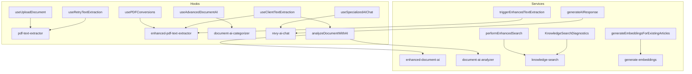

# Frontend Supabase Flow

This document shows which React hooks and frontend services invoke the main Supabase edge functions. The arrows in the diagram point from the caller to the edge function being executed.

### Hooks
- **useUploadDocument** and **useRetryTextExtraction** start background processing by calling `pdf-text-extractor`.
- **usePDFConversions** triggers `enhanced-pdf-text-extractor` for advanced conversions.
- **useClientTextExtraction** first attempts frontend parsing and then calls `enhanced-pdf-text-extractor`; when finished it runs `analyzeDocumentWithAI` for further analysis.
- **useAdvancedDocumentAI** sends files to `document-ai-categorizer`.
- **useSpecializedAIChat** communicates with the `revy-ai-chat` assistant.

### Services
- **analyzeDocumentWithAI** decides between `enhanced-document-ai` and `document-ai-analyzer` based on configuration.
- **generateAIResponse** is the standard chat helper that invokes `revy-ai-chat`.
- **performEnhancedSearch** logs search metrics and queries `knowledge-search`.
- **triggerEnhancedTextExtraction** allows re-running `enhanced-pdf-text-extractor` for a document.
- **generateEmbeddingsForExistingArticles** invokes `generate-embeddings` for knowledge articles.
- **KnowledgeSearchDiagnostics** performs health checks by querying `knowledge-search`.
