# Repository Structure

The diagram below shows an overview of the main folders in `revy-audit-insights`.

```mermaid
flowchart TD
    repo["revy-audit-insights"]

    subgraph Root-mapper
        repo --> docs[Docs]
        repo --> src[Src]
        repo --> supabase[Supabase]
        repo --> cypress[Cypress]
        repo --> public[Public]
        repo --> scripts[Scripts]
        repo --> config[Konfigurasjonsfiler]
    end

    subgraph Src
        src --> components[Components]
        src --> pages[Pages]
        src --> services[Services]
        src --> hooks[Hooks]
        src --> integrations[Integrations]
        src --> store[Store]
        src --> types[Types]
        src --> utils[Utils]
        src --> lib[Lib]
        src --> constants[Constants]
    end

    subgraph Supabase
        supabase --> functions[Functions]
        supabase --> migrations[Migrations]
    end

    subgraph Functions
        functions --> shared[_shared]
        functions --> brreg[brreg]
        functions --> docai_analyzer["document-ai-analyzer"]
        functions --> docai_categorizer["document-ai-categorizer"]
        functions --> enhanced_docai["enhanced-document-ai"]
        functions --> enhanced_pdf_text["enhanced-pdf-text-extractor"]
        functions --> generate_embeddings["generate-embeddings"]
        functions --> knowledge_search["knowledge-search"]
        functions --> pdf_converter["pdf-converter"]
        functions --> pdf_text["pdf-text-extractor"]
        functions --> revy_ai_chat["revy-ai-chat"]
        functions --> setup_storage["setup-storage"]
        functions --> syncKunngjoring["syncKunngjoring"]
        functions --> text_to_speech["text-to-speech"]
        functions --> voice_to_text["voice-to-text"]
    end

    subgraph Cypress
        cypress --> e2e[E2E tests]
        cypress --> fixtures[Fixtures]
        cypress --> support[Support]
    end

    subgraph Docs
        docs --> audit_action_generator["audit-action-generator.md"]
        docs --> audit_phases["audit-phases.md"]
        docs --> backend_flow["backend-endpoints-flow.md"]
        docs --> brreg["brreg.md"]
        docs --> classification["classification.md"]
        docs --> doc_workflow["document-workflow.md"]
        docs --> manage_audit_actions["manage-audit-actions.md"]
        docs --> modules_overview["modules-overview.md"]
        docs --> project_overview["project-overview.md"]
        docs --> service_role_functions["service-role-functions.md"]
        docs --> sidebar_overview["sidebar-overview.md"]
        docs --> upload_column_mappings["upload-column-mappings.md"]
    end

    subgraph Config_files
        config --> README[README.md]
        config --> packagejson[package.json]
        config --> lockfiles["package-lock.json / bun.lockb"]
        config --> tailwind["tailwind.config.ts"]
        config --> vite["vite.config.ts"]
        config --> tsconfig["tsconfig*.json"]
        config --> eslint["eslint.config.js"]
    end
```

Additional explanations of the main modules can be found in [modules-overview.md](modules-overview.md).
